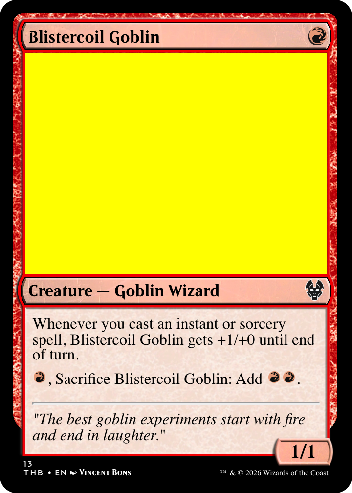

# mtg-card-renderer

A Kotlin/Spring Boot service that renders Magic: The Gathering cards from [Scryfall](https://scryfall.com/docs/api)-format JSON data. It produces high-quality card images (PNG, JPG) using a headless Chromium browser powered by [Playwright](https://playwright.dev/).



## How it works

1. You POST card data in Scryfall JSON format to the REST API
2. The service loads the card-rendering HTML/CSS/JS in a headless Chromium browser
3. The card is rendered in the DOM with accurate frames, mana symbols, text layout, and art
4. A screenshot of the card element is taken and returned as PNG or JPG

Supports all major card types: creatures, planeswalkers, sagas, adventures, modal DFCs, transform cards, vehicles, and more.

## Prerequisites

- Java 21+
- Playwright Chromium browser (installed automatically on first run, or run `npx playwright install chromium`)

## Quick start

```bash
./gradlew app:bootRun
```

The server starts on port 8080. Open http://localhost:8080/swagger-ui.html for the interactive API docs.

## API

### POST /api/render

Renders a card image from Scryfall JSON.

**Query parameters:**
| Parameter | Default | Description |
|-----------|---------|-------------|
| `format`  | `PNG`   | Output format: `PNG` or `JPG` |
| `scale`   | `3`     | Render scale factor (3 produces ~720px wide) |

**Example:**

```bash
curl -X POST 'http://localhost:8080/api/render?format=PNG&scale=3' \
  -H "Content-Type: application/json" \
  -d '{"name":"Lightning Bolt","mana_cost":"{R}","type_line":"Instant","oracle_text":"Lightning Bolt deals 3 damage to any target.","colors":["R"],"set":"lea","collector_number":"161","rarity":"common","artist":"Christopher Rush","lang":"en"}' \
  -o card.png
```

## Building

```bash
./gradlew app:bootJar        # Build executable JAR
./gradlew app:compileKotlin   # Compile only
```

## Project structure

```
app/
  src/main/kotlin/             # Spring Boot application, REST controller, render service
  src/main/resources/
    static/card-rendering/     # HTML/CSS/JS card renderer + all card frame assets
    application.yml            # Server configuration
gradle/libs.versions.toml     # Dependency versions
buildSrc/                      # Gradle convention plugins
```
